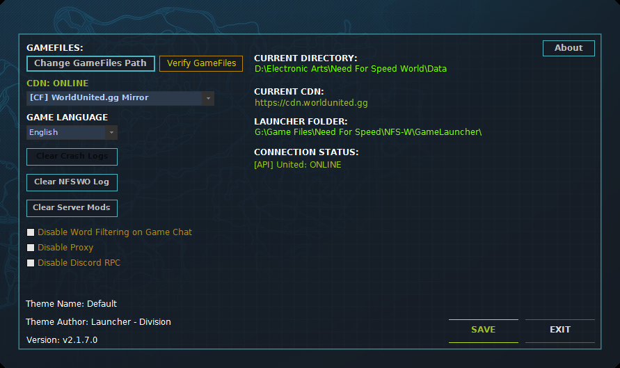
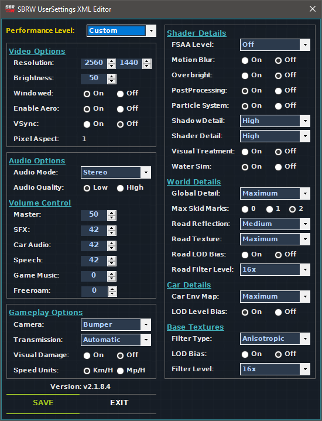

# GameLauncher_NFSW 
A Rewrite of GameLauncher taken from Need For Speed: World

## Changelog (12/23/2023)
- Added Thrustmaster T-80 Controller Support
- Added NFS Inspired Soundtrack Wrapper
- Added New Sub Launcher Enable to run the extra Features.
## Features
- [X] Game Client Downloader
- [X] UserSettings.xml Editor
- [X] Game Files Validator
- [X] Firewall Checker
- [X] Windows Defender (Windows 10 Only)
- [X] Discord Rich Presense / RemoteRPC
- [X] Self-Signed Code Sign Certificate

### Screenshot

