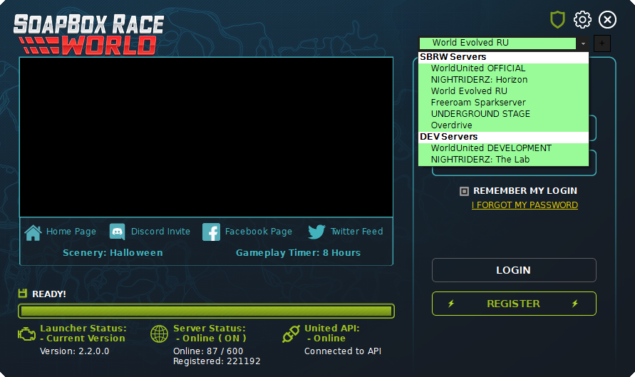
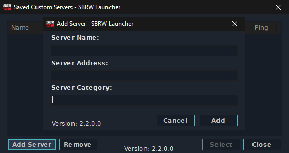
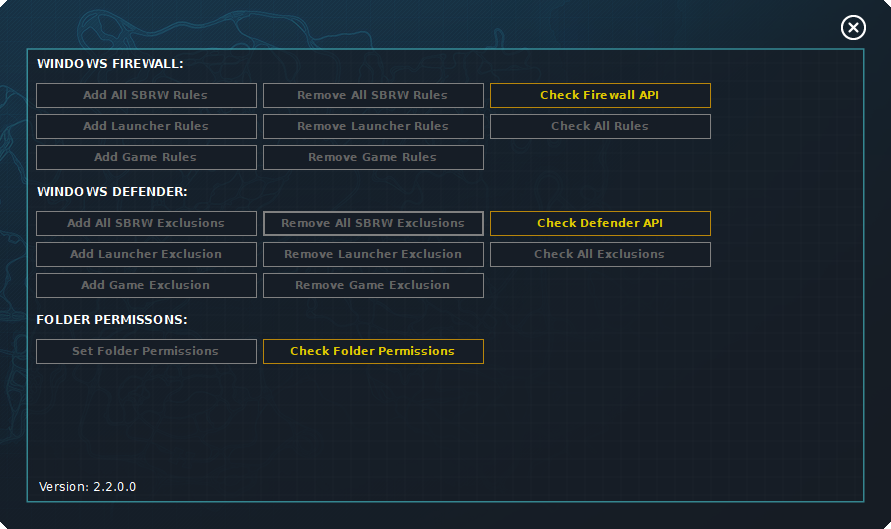
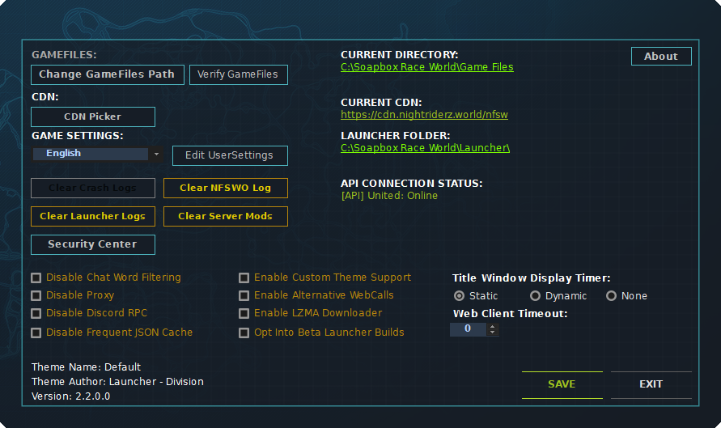
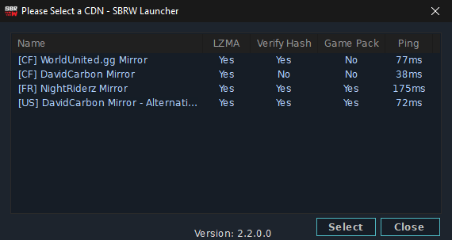
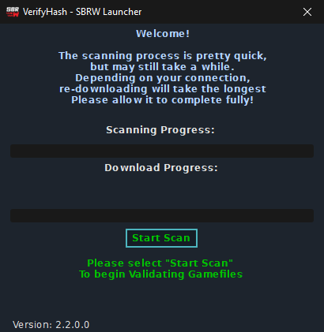
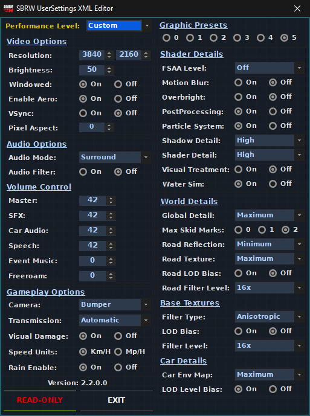

# SBRW.Launcher 
A Rewrite of GameLauncher taken from Need For Speed: World

## Features
- [X] Game Client Downloader
- [X] UserSettings.xml Editor
- [X] Game Files Validator
- [X] Firewall Checker
- [X] Windows Defender (Windows 10 Only)
- [X] Discord Rich Presense / RemoteRPC
- [X] Self-Signed Code Sign Certificate

### Screenshot

