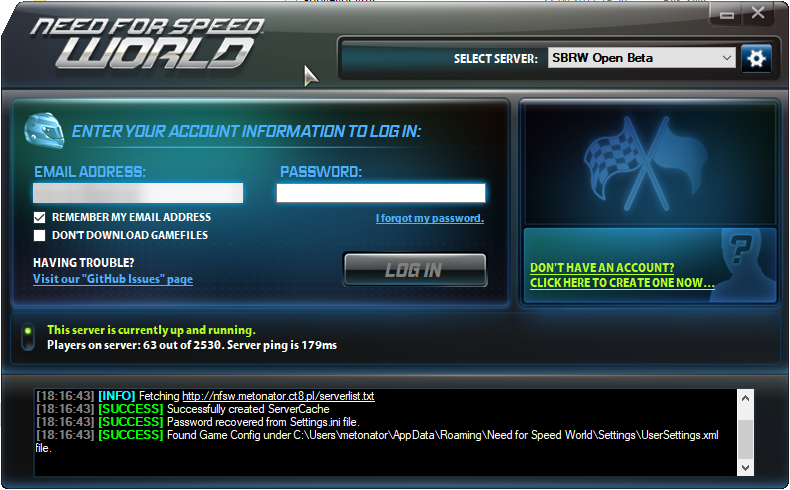

# GameLauncher_NFSW 
A Rewrite of GameLauncher taken from Need For Speed: World

### As of 2/6/2019 Interface_v1 is currently
- 
- 

## Todo
- [ ] Downloader?
- [ ] Validate files (sha1?)
- [X] Complete UI
- [X] Original fonts

### Screenshot

(Status as of `09.06.2017 01:45 GMT+2`)
